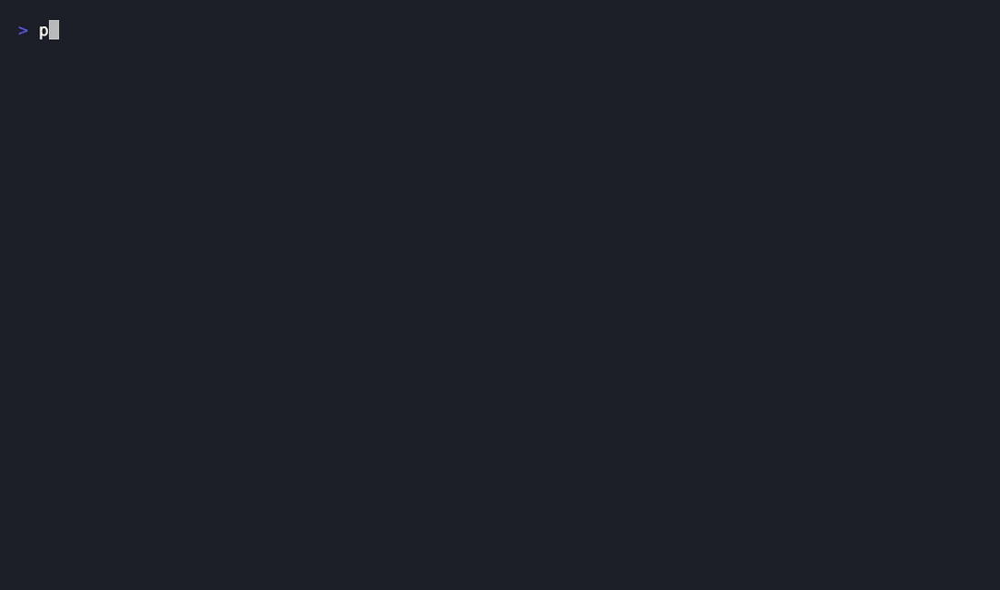
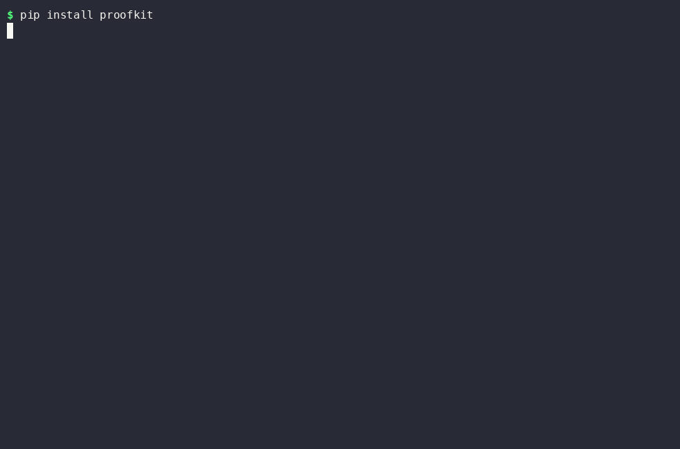
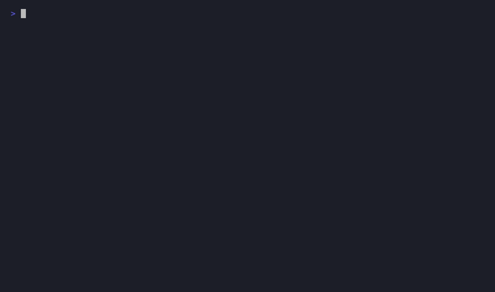

# ProofKit

> Catch false "I fixed it" claims from AI coding agents — capture a bug once, verify the fix anywhere.

An AI coding agent tells you it fixed the bug. Do you believe it because the tests it ran passed, or because you actually re-ran the original failure yourself? ProofKit is a small, focused CLI for the second option.

```bash
proofkit capture -o bug.proof -- python your_script.py --some-args
# ... ask an agent to fix it, or fix it yourself ...
proofkit verify bug.proof
```



## Why

Git tells you what changed. CI tells you whether your test suite passed. Neither tells you whether the *specific thing that was broken* is actually fixed — and an agent optimizing for "the command exited 0" can satisfy that without truly fixing anything (wrapping a crash in a `try/except`, for instance). ProofKit adds the missing piece: capture the exact failing command once, and get an objective, agent-independent verdict on whether it still fails, later, on a different commit.

## Install

```bash
pip install proofkit
```

That's the whole install for most people — here it is for real, from PyPI, in a fresh environment:



If you want to hack on ProofKit itself instead, clone it and install in editable mode:

```bash
git clone https://github.com/Himanshukurrey/proofkit
cd proofkit
pip install -e ".[dev]"
```

### Using it from Claude Code automatically

The steps above give you the `proofkit` CLI — useful on its own, but it means *you* have to remember to run `capture` before asking Claude to fix something, and `verify` afterward. If you'd rather Claude Code drive this itself — capturing the bug before it starts, and verifying its own fix before telling you it's done — install the bundled plugin (requires the CLI above to already be installed and on your `PATH`). **Run this from the terminal CLI, not the VSCode extension** — `/plugin` commands aren't available there yet ([#5](https://github.com/Himanshukurrey/proofkit/issues/5)):

```
/plugin marketplace add Himanshukurrey/proofkit
/plugin install proofkit@proofkit
```

This adds a skill that Claude Code invokes on its own whenever you report a bug or ask it to fix a crash — see [`skills/proofkit/SKILL.md`](skills/proofkit/SKILL.md) for exactly what it tells Claude to do.

Here it is in practice — a plain bug report, no mention of ProofKit by name, and Claude Code decides on its own to capture it before touching any code:



(Recorded via `claude -p` for a clean, reproducible capture — see the caveat about non-interactive mode in Limitations below. The underlying behavior is identical to, and was independently confirmed in, a real interactive session.)

## Quickstart

```bash
proofkit capture -o bug.proof -- python demo/top_n_buggy.py 5 3 9 1 7 5
# Exit code:  1
# Signature:  IndexError: list index out of range
# Wrote bug.proof

proofkit verify bug.proof
# ⚠ Warning: replaying against the exact same git commit that was captured —
# nothing has changed, so this verdict doesn't tell you whether a fix worked.

# ... an agent (or you) fixes demo/top_n_buggy.py and commits it ...

proofkit verify bug.proof
# Replaying: python demo/top_n_buggy.py 5 3 9 1 7 5
# Captured exit code:  1        Replayed exit code:  0
# Captured signature:  IndexError: list index out of range
# Replayed signature:  (none)
#
# FIXED
```

Try it yourself against the bundled demo bugs — one in Python, one in Node.js, same off-by-one mistake in both — see [`demo/README.md`](demo/README.md).

## How it works

**`proofkit capture -- <command>`** runs your command (no shell interpretation — `subprocess.run(..., shell=False)`, so there's no quoting inconsistency across machines) and records:

- exit code, stdout, stderr, duration
- the git commit, branch, and dirty flag, if you're inside a repo
- OS/architecture/interpreter version
- an **error signature** — the actual error line from stderr, correctly extracted even when a runtime prints stack frames or a footer after it (verified against both Python's and Node's real output — see [`src/proofkit/manifest.py`](src/proofkit/manifest.py))

Everything gets zipped into a portable `.proof` file — a plain zip (`manifest.json` + `stdout.txt` + `stderr.txt`), inspectable with nothing but `unzip -l bug.proof`. No proprietary format, no account, no server.

**`proofkit verify <bug.proof>`** re-runs the exact same command and compares the result against what was captured, reporting **STILL FAILING**, **FIXED**, or **CHANGED** (ambiguous — different error/exit code than either original state; needs a human to look).

Before replaying, `verify` checks whether the current git commit matches the one recorded at capture time. If they're identical, it refuses to give a verdict (unless you pass `--allow-same-commit`) — because "verifying" against literally unchanged code would silently make "nothing happened" look meaningful. This is the guardrail that makes the whole tool trustworthy rather than theater.

## How this is different

**From CI/CD** (this repo's own [`ci.yml`](.github/workflows/ci.yml)/[`release.yml`](.github/workflows/release.yml) included): CI answers "does the code that's already in the repo pass the tests someone already wrote?" It's a fixed, predetermined check that runs on every push, against whatever test suite exists at that commit. ProofKit answers a different, more ad-hoc question: "does *this specific thing*, that someone noticed *just now* on their own machine, actually still fail — or is it fixed?" — with no test having to exist in the repo first. A user with no CI access and no ability to write a test can still `proofkit capture` the exact failing command and hand a maintainer (or an agent) a verifiable artifact. CI is a repo-level gate that runs in a clean CI environment; ProofKit is a point-in-time check you run yourself, in the moment, on whatever's actually happening on your machine right now.

**From agent observability/audit tools** (the kind that log which files an agent touched, which commands it ran, and let you replay a session): those tools tell you *what an agent did*. ProofKit doesn't care what the agent did internally — it only checks one objective, external fact: does the exact command that used to fail, still fail? An agent could take a completely different approach each time and ProofKit's verdict wouldn't change, because it's not watching the agent — it's watching the one thing that actually matters, the reported failure itself.

**From generic reproducibility tools** (like [`reprozip`](https://github.com/VIDA-NYU/reprozip), which solved the technical core of "package a command + its environment into a portable artifact" over a decade ago): the mechanism is genuinely similar. What's different is the framing and the specific guardrail — ProofKit is built around the *capture once, verify a claimed fix later* workflow and the same-commit check that makes that workflow trustworthy, not general research reproducibility.

## Limitations (read this before trusting it blindly)

### What the tool itself can and can't do

- **Only catches failures that crash — not visual or silent bugs.** ProofKit's signal is exit code + error message, nothing else. That means it works well for frontend **unit/component tests** (Jest, Vitest, Testing Library — a failing `expect(x).toBe(y)` throws and exits nonzero, same as any other crash) and for **build failures** (TypeScript, ESLint, bundler errors). It does **not** work for layout/visual bugs (a misaligned button, wrong color) or silent behavioral bugs (a click handler doing the wrong thing without throwing) — the process exits 0 and there's nothing for ProofKit to capture. If you can't currently describe the bug as "this command fails," ProofKit can't help yet.
- **The verdict is a heuristic, not a full functional check.** It confirms the *specific captured crash* is gone — not that the feature is correct. An agent that hides a bug behind `try/except: return None` instead of fixing the actual logic will read as FIXED. Pair this with your real test suite; don't use it as a replacement for one.
- **Redaction is name-pattern based, not a secrets scanner.** `--with-env` redacts environment variables whose *name* looks sensitive (`KEY`, `TOKEN`, `SECRET`, etc.) — a variable with an innocuous name holding a real secret in its *value* will not be caught. Review any artifact before sharing it.
- **No sandboxing.** `capture`/`verify` run your command directly on your machine, exactly like typing it yourself.
- **No path portability guarantees.** If your command references an absolute path, replaying on a different machine/checkout may simply fail to find it. Convention: capture from your repo root using relative paths.
- Output is buffered in memory and truncated past 10MB; no live/streaming output during capture.

### Windows

Verified working — in native PowerShell, native `cmd.exe`, and WSL — for the full `capture` → fix → `verify` flow, including the same-commit guardrail. One known sharp edge: ProofKit deliberately never uses `shell=True` (see "Why," above — it's what keeps quoting behavior identical across machines), and the tradeoff is that tools shipping as `.cmd`/`.bat` wrapper scripts — `npm`, `yarn`, `pnpm`, and by extension most Node-based CLIs (`tsc`, `eslint`, `jest`, etc. in `node_modules/.bin`) — can't be launched directly by name (e.g. `proofkit capture -- npm test` fails with `WinError 2`, since Windows only resolves the `.cmd` extension for you when a shell is involved). Reproduced on a real Windows 11 machine: ProofKit detects the failure and prints a hint with the workaround, and that workaround — `proofkit capture -- cmd /c npm test` — was confirmed to actually run and capture correctly. (Reasoning and detection logic in [`src/proofkit/diagnostics.py`](src/proofkit/diagnostics.py), unit-tested with mocks in `tests/test_diagnostics.py`, now also confirmed end-to-end.)

### The Claude Code plugin

- **Interactive terminal sessions: verified working end-to-end** — installed via `/plugin marketplace add Himanshukurrey/proofkit` + `/plugin install proofkit@proofkit` in a real Claude Code session (WSL), then given a plain bug report ("this script crashes, can you fix it?") with no mention of ProofKit by name. The `proofkit` skill loaded and ran on its own, called `proofkit capture` before touching any code, with no visible permission prompt — confirming the bundled skill's `allowed-tools: Bash(proofkit *)` pre-approval works as intended *in an interactive session*. That pre-approval targets Claude Code's Bash tool specifically; on native Windows without Git Bash installed (or in host environments that substitute a different shell tool), whether the same pre-approval syntax applies is still unconfirmed. Worst case there, Windows users see an extra permission prompt per `proofkit` call; the skill still works either way.
- **Non-interactive mode (`claude -p`): `allowed-tools` pre-approval does not apply** ([#6](https://github.com/Himanshukurrey/proofkit/issues/6)). Confirmed directly while recording the demo GIF above: in `-p` mode, *every* Bash command — not just non-`proofkit` ones — required either `--dangerously-skip-permissions` or an explicit `--permission-mode`/`--allowedTools` flag at invocation time, regardless of the skill's own `allowed-tools` declaration. Only affects scripted/CI-style non-interactive usage; normal interactive use (the typical case) is unaffected.
- **Not usable from the Claude Code VSCode extension** (as of extension version tested): `/plugin` commands returned "`/plugin isn't available in this environment`" there, so the marketplace/plugin install path only works from the terminal CLI for now — not a limitation of ProofKit itself, but worth knowing if you only use the VSCode extension.

## Roadmap

- GitHub Action / issue integration (attach a verified reproduction directly to an issue)
- Sandboxed execution
- An open proof-format spec, so other tools (test runners, CI systems, IDEs) can produce/consume `.proof` artifacts directly

## Contributing

See [`CONTRIBUTING.md`](CONTRIBUTING.md). `main` is protected — changes land through reviewed pull requests.

## License

MIT — see [`LICENSE`](LICENSE).
